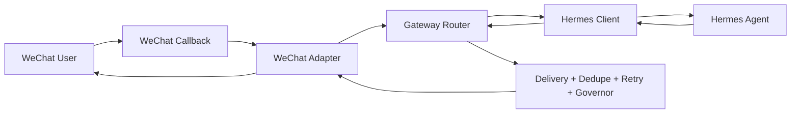

# Hermes WeChat Bridge

[](https://github.com/luSkyl/hermes-wechat-bridge/actions/workflows/ci.yml)
[](https://github.com/luSkyl/hermes-wechat-bridge/actions/workflows/codeql.yml)
[](https://github.com/luSkyl/hermes-wechat-bridge/releases)
[](LICENSE)
[](pyproject.toml)

Hermes WeChat Bridge is the clean sidecar for connecting **Hermes Agent** to **WeChat** without forking, patching, or polluting Hermes core or Hermes Web UI.

It gives you one opinionated golden path:

```text
WeChat User -> WeChat Callback -> Bridge Runtime -> Hermes Agent -> Friendly Reply
```

The bridge owns the WeChat runtime: callback normalization, signature checks, session mapping, dedupe, retry, graceful degradation, friendly user replies, local simulation, and operational diagnostics. Hermes and Hermes Web UI stay independently upgradeable.

## Why This Exists

Most WeChat integrations become hard to maintain because channel-specific code leaks into the agent runtime, UI, deployment scripts, and private configs. This project keeps those concerns separate:

| Project | Responsibility |
|---|---|
| Hermes Agent | Agent reasoning, tools, and conversation behavior |
| Hermes Web UI | Human-facing control plane and observation surface |
| Hermes WeChat Bridge | WeChat callback, delivery, reliability, service API, and simulator |

## What You Get

- **Stable bridge contract**: normalized message protocol between WeChat and Hermes.
- **Safe local development**: simulator fixtures run without real WeChat credentials.
- **Production guardrails**: signature verification, service API token checks, retry, dedupe, delivery governor, and health/status endpoints.
- **Complete notification loop**: friendly-card templates, `send_message_tool`-style notifier, Cron adapter, Guardian adapter, governed queue, and flush API.
- **Upgrade-friendly boundary**: compatibility tests and docs make Hermes/Hermes Web UI upgrades contract-driven.
- **Open-source ready workflow**: CI, CodeQL, Scorecard, Dependabot, release assets, governance, and security policy.

## Quick Start

Clone the repository and run the bridge in mock Hermes mode:

```powershell
git clone https://github.com/luSkyl/hermes-wechat-bridge.git
cd hermes-wechat-bridge
python -m venv .venv
.\.venv\Scripts\Activate.ps1
python -m pip install -e .[dev]
python -m bridge.cli doctor --config examples/minimal/config.yaml
python -m bridge.cli simulate --config examples/minimal/config.yaml --event simulator/sample_events/text.json
python -m bridge.cli serve --config examples/minimal/config.yaml --host 127.0.0.1 --port 8787
python -m bridge.cli notify --config examples/minimal/config.yaml --target wxid_home --title "上游模型已恢复" --text "模型恢复后需要重新执行定时任务。" --priority high
python -m bridge.cli flush --config examples/minimal/config.yaml --target wxid_home --limit 3
```

Expected simulator output includes a delivered dry-run reply from the bridge runtime:

```json
{
  "status": "delivered",
  "reply_text": "Hermes mock reply: ..."
}
```

Prefer a released artifact? Download the wheel or source archive from [Releases](https://github.com/luSkyl/hermes-wechat-bridge/releases), or install a pinned tag directly:

```powershell
python -m pip install "git+https://github.com/luSkyl/hermes-wechat-bridge.git@v0.1.0-alpha.1"
```

## Gateway Flow



## Service API

The callback server also exposes a small service surface for operators and future Web UI integration:

| Endpoint | Purpose |
|---|---|
| `GET /health` | Liveness check |
| `GET /status` | Bridge status and configured capabilities |
| `POST /simulate` | Run a simulated event through the bridge |
| `POST /sessions/{id}/message` | Send a controlled message into a session |

When binding to a non-loopback host, `runtime.service_api_token` is required so operational APIs do not become accidentally public.

## Production Shape

- Start with `examples/minimal/config.yaml`, then replace placeholders with your WeChat and Hermes settings.
- Keep real tokens in environment-specific secret stores; do not commit production configs.
- Put the bridge behind HTTPS before pointing WeChat callbacks at it.
- Keep `wechat.governor_enabled` on in production so failed attempts, not only visible messages, count toward the learned send budget.
- Run the compatibility tests after Hermes or Hermes Web UI upgrades.
- Treat bridge release tags as the deployment boundary for WeChat runtime behavior.

## Non-Goals

- A full multi-platform gateway.
- A Web UI.
- Real tokens, production configs, private logs, or historical runtime state.
- A replacement for Hermes Agent.

## Documentation

- [Quickstart](docs/quickstart.md)
- [Protocol](docs/protocol.md)
- [Service API](docs/service-api.md)
- [Architecture](docs/architecture.md)
- [Gateway Flow](docs/gateway-flow.md)
- [Message Lifecycle](docs/message-lifecycle.md)
- [Runtime Notifications](docs/runtime-notifications.md)
- [Failure Modes](docs/failure-modes.md)
- [Sync Strategy](docs/sync-strategy.md)
- [Compatibility Matrix](docs/compatibility-matrix.md)
- [Migration Map](docs/migration-map.md)
- [Upgrade Playbook](docs/upgrade-playbook.md)
- [Configuration](docs/configuration.md)
- [WeChat Setup](docs/wechat-setup.md)
- [Troubleshooting](docs/troubleshooting.md)
- [Security Model](docs/security-model.md)
- [Production Checklist](docs/production-checklist.md)
- [Open Source Launch](docs/open-source-launch.md)

## Project Status

This project is in alpha. The latest published prerelease is `v0.1.0-alpha.3`, with Python package version `0.1.0a3`. The public contract is intentionally small: Hermes client contract, WeChat callback normalization, bridge service API, simulator fixtures, and compatibility tests.

Use the alpha to validate the architecture, local simulator, and upgrade boundary. Production adopters should review [Security Model](docs/security-model.md), [Production Checklist](docs/production-checklist.md), and [Release Process](RELEASE.md) before exposing callbacks publicly.

## Community

- Read [Contributing](CONTRIBUTING.md) before opening pull requests.
- Use [Security](SECURITY.md) for vulnerabilities or accidental secret exposure.
- See [Roadmap](ROADMAP.md) for planned production hardening.
- See [Governance](GOVERNANCE.md) for scope and decision rules.
- See [Support](SUPPORT.md) for where to ask questions.

## License

MIT
