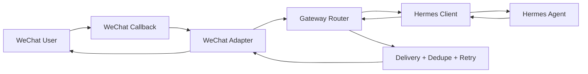

# Hermes WeChat Bridge


A stable and friendly bridge from Hermes Agent to WeChat.

This project gives you one recommended path to connect Hermes Agent with WeChat:

```text
WeChat User -> WeChat Callback -> Bridge Runtime -> Hermes Agent -> Friendly Reply
```

It focuses on reliable message delivery, dedupe, retry, graceful degradation, friendly user-visible replies, session continuity, local simulation, and production diagnostics.

## Gateway Flow



## Quick Start

```powershell
python -m venv .venv
.\.venv\Scripts\Activate.ps1
python -m pip install -e .[dev]
python -m bridge.cli doctor --config examples/minimal/config.yaml
python -m bridge.cli simulate --config examples/minimal/config.yaml --event simulator/sample_events/text.json
python -m bridge.cli serve --config examples/minimal/config.yaml --host 127.0.0.1 --port 8787
```

Expected simulator output includes a friendly reply generated through the bridge runtime in mock Hermes mode.

## What Is Included

- A small message protocol for Hermes-to-WeChat bridge events.
- A WeChat adapter with signature verification helpers.
- A Hermes client abstraction with mock and HTTP modes.
- Runtime routing with session lookup, dedupe, retry, and friendly formatting.
- A local simulator that runs without real WeChat credentials.
- A minimal callback server for verification and local webhook testing.
- Contract and integration tests.
- Open-source governance, CI, security scanning, release process, and issue templates.

## What Is Not Included

- A full multi-platform gateway.
- A Web UI.
- Real tokens, production configs, private logs, or historical runtime state.
- A replacement for Hermes Agent.

## Documentation

- [Quickstart](docs/quickstart.md)
- [Protocol](docs/protocol.md)
- [Service API](docs/service-api.md)
- [Architecture](docs/architecture.md)
- [Gateway Flow](docs/gateway-flow.md)
- [Message Lifecycle](docs/message-lifecycle.md)
- [Failure Modes](docs/failure-modes.md)
- [Sync Strategy](docs/sync-strategy.md)
- [Compatibility Matrix](docs/compatibility-matrix.md)
- [Migration Map](docs/migration-map.md)
- [Upgrade Playbook](docs/upgrade-playbook.md)
- [Configuration](docs/configuration.md)
- [WeChat Setup](docs/wechat-setup.md)
- [Troubleshooting](docs/troubleshooting.md)
- [Security Model](docs/security-model.md)
- [Production Checklist](docs/production-checklist.md)
- [Open Source Launch](docs/open-source-launch.md)

## Project Status

This project is in `0.1.0` alpha. The public contract is intentionally small: Hermes client contract, WeChat callback normalization, bridge service API, simulator fixtures, and compatibility tests.

## Community

- Read [Contributing](CONTRIBUTING.md) before opening pull requests.
- Use [Security](SECURITY.md) for vulnerabilities or accidental secret exposure.
- See [Roadmap](ROADMAP.md) for planned production hardening.
- See [Governance](GOVERNANCE.md) for scope and decision rules.

## License

MIT
