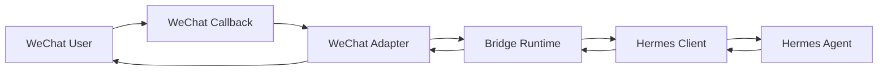

# Architecture

Hermes WeChat Bridge is intentionally narrow. It provides one recommended path from Hermes Agent to WeChat rather than a generic multi-platform gateway.

## System Boundary

## Modules

- `bridge.protocol`: stable event, delivery, session, and error models.
- `bridge.wechat`: WeChat signature verification, inbound parsing, outbound formatting, and dry-run sending.
- `bridge.hermes`: Hermes client abstraction for mock and HTTP modes.
- `bridge.runtime`: router, dedupe, retry, health, diagnostics, and logging helpers.
- `simulator`: local event replay without real WeChat credentials.

## Design Principles

- One golden path is better than many incomplete paths.
- User-visible replies should be friendly and safe.
- Runtime reliability belongs in the bridge, not in every adapter.
- Local simulation must work before production credentials are required.
- Public contracts should be simple enough to test directly.
