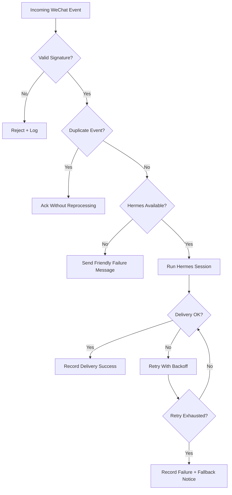

# Failure Modes

## Friendly Fallbacks

- Invalid signature: reject without user-visible detail.
- Duplicate event: acknowledge without a second Hermes call.
- Hermes timeout: tell the user the agent is busy and suggest retrying later.
- Delivery failure: retry with backoff and record diagnostic context.
- Overlong response: split or summarize before sending.

## Operator Signals

Every failure should provide an operator-facing reason while keeping user-visible replies safe and short.
