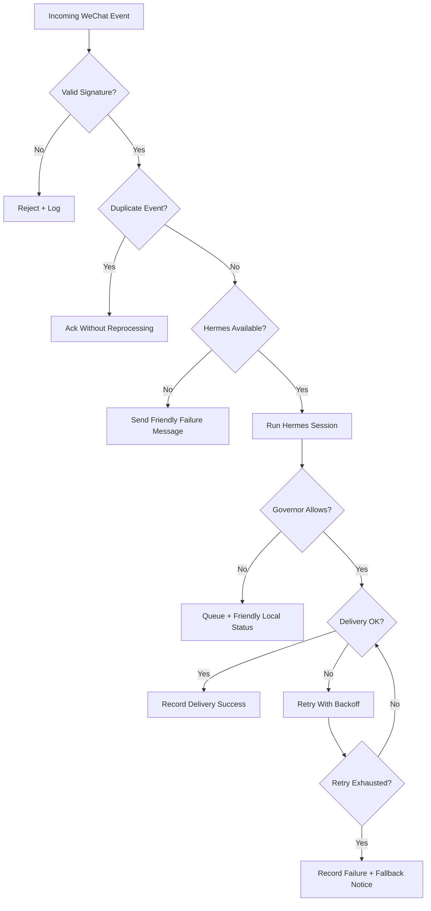

# Failure Modes

## Friendly Fallbacks

- Invalid signature: reject without user-visible detail.
- Duplicate event: acknowledge without a second Hermes call.
- Hermes timeout: tell the user the agent is busy and suggest retrying later.
- Delivery failure: retry with backoff and record diagnostic context.
- Weixin rate limit: count the failed attempt, open the governor, queue remaining notifications, and wait for the next window.
- Overlong response: split or summarize before sending.
- Governor queued: do not send a WeChat message explaining the limit; expose a friendly card through local/Web UI status and merge queued notifications later.

## Operator Signals

Every failure should provide an operator-facing reason while keeping user-visible replies safe and short.
