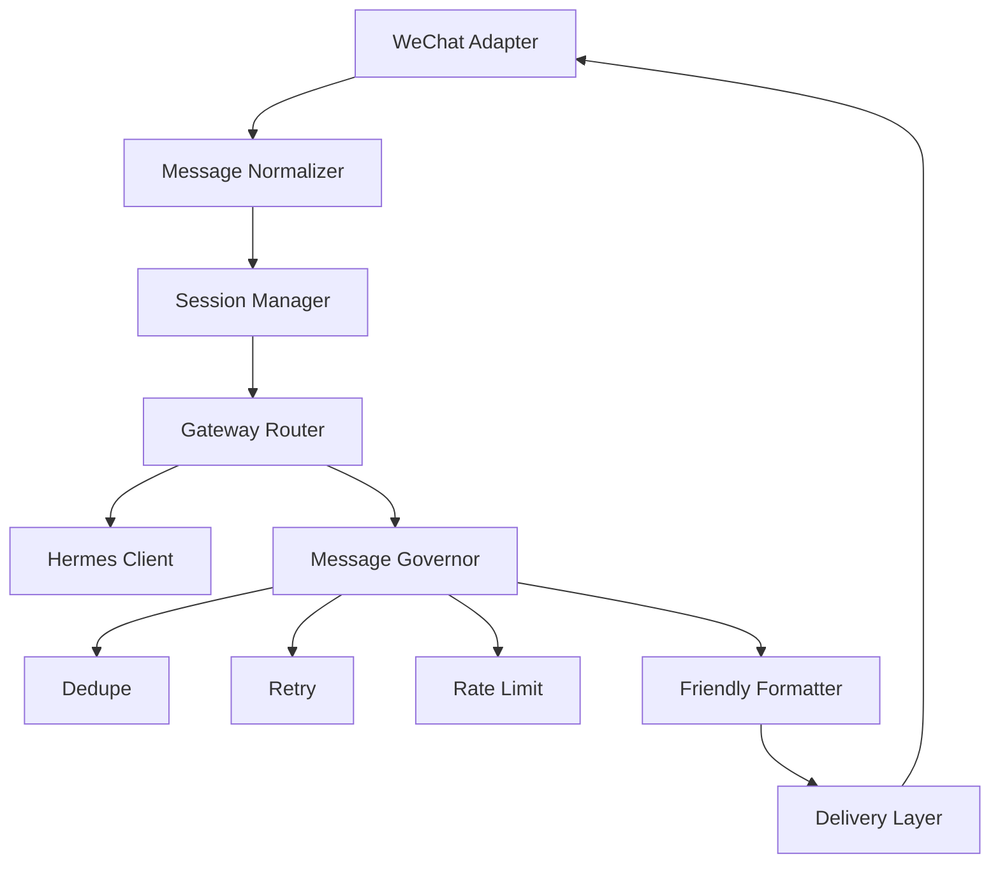

# Gateway Flow

The gateway is the bridge runtime between WeChat and Hermes Agent.

## Internal Components

## Responsibilities

- Adapter: verifies and converts WeChat webhook payloads.
- Normalizer: turns platform-specific payloads into protocol events.
- Session manager: maps WeChat users and conversations to Hermes sessions.
- Router: sends normalized messages to Hermes and returns delivery requests.
- Message governor: applies dedupe, retry, timeout, and friendly degradation.
- Delivery layer: sends or dry-runs outbound WeChat replies.

## Extension Rule

The MVP only supports WeChat. If future platforms are added, they should implement the same protocol and contract tests instead of changing router internals.
