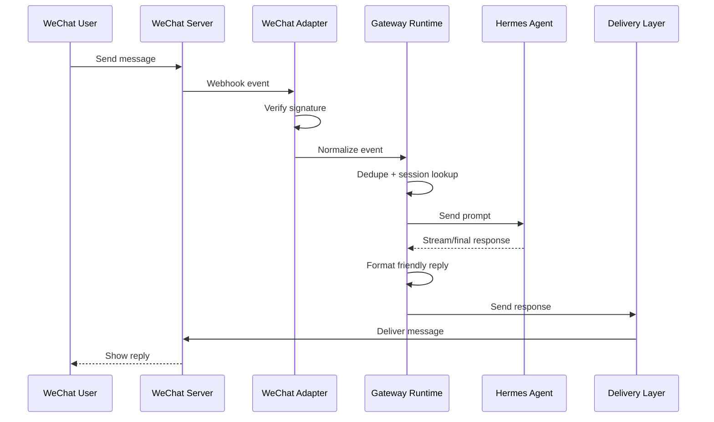

# Message Lifecycle

## Event States

1. `received`: raw webhook reached the adapter.
2. `verified`: signature and required fields passed validation.
3. `normalized`: payload became a `MessageEvent`.
4. `routed`: the event was mapped to a Hermes session.
5. `answered`: Hermes returned a response or a safe fallback was generated.
6. `delivered`: outbound message was sent or dry-run emitted.

## Idempotency

The bridge deduplicates by event ID. Replayed webhook events should be acknowledged without invoking Hermes again.
