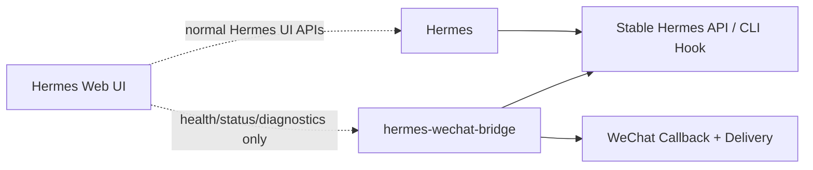

# Sync Strategy

This project is the long-term owner of the Hermes to WeChat chain. Hermes and Hermes Web UI should stay upgradeable and should not accumulate WeChat-specific runtime logic.

## Ownership Boundary

## Classification Rules

Every change currently living in Hermes or Hermes Web UI must be classified before migration.

| Class | Owner | Action |
|---|---|---|
| Hermes core required | Hermes | Keep as a minimal stable API or hook. |
| Bridge owned | hermes-wechat-bridge | Migrate into protocol, runtime, WeChat adapter, diagnostics, or tests. |
| Web UI optional | Hermes Web UI | Keep as read-only display over bridge APIs. |
| Private/runtime | none | Do not migrate; keep local or discard. |

## Sync Loop

1. Freeze current user-visible WeChat behavior as examples and contract tests.
2. Move one capability at a time into this bridge.
3. Add or update tests before removing behavior from Hermes or Hermes Web UI.
4. Keep Hermes changes additive and minimal.
5. Keep Web UI changes read-only and optional.
6. Record every migrated capability in `docs/migration-map.md`.

## Source of Truth

- WeChat callback handling: this bridge.
- WeChat message formatting and delivery: this bridge.
- Dedupe, retry, session mapping, and friendly fallback: this bridge.
- Agent execution: Hermes.
- Bridge observation panels: optional Hermes Web UI integration.

## Anti-Patterns

- Do not import Hermes internal modules from bridge code.
- Do not put WeChat callback runtime inside Hermes Web UI.
- Do not keep two active implementations of the same WeChat delivery path.
- Do not migrate real tokens, logs, private chat IDs, or local state.
